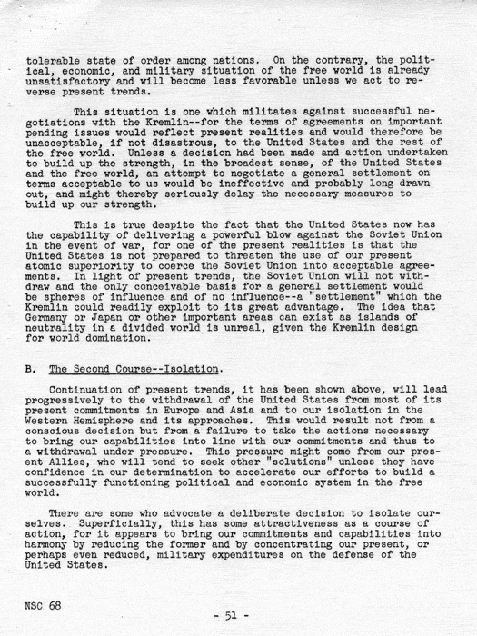

```


               ____  _       _         _____         _            
              |  _ \| | __ _(_)_ __   |_   _|____  _| |_ 
              | |_) | |/ _` | | '_ \    | |/ _ \ \/ / __|
              |  __/| | (_| | | | | |   | |  __/>  <| |_ 
              |_|   |_|\__,_|_|_| |_|   |_|\___/_/\_\\__|

               Die unerträgliche Leichtigkeit des Seins


                                rohieb
                                
                                GPN19


        
```

Wer bin ich?
============

* Twitter: @daniel_bohrer
* Fediverse: @daniel_bohrer@chaos.social
* E-Mail: rohieb+gpn19.yhA7rNxr@rohieb.name

Definition
==========

::: {.columns}
:::: {.column width="70%"}

* menschenlesbarer Text ohne Informationen über grafische Darstellung
* "nur Buchstaben"
  - ASCII: "printable chars", Zeichen 32--126 (0x20--0x7E)
    + darauf aufbauende Zeichenkodierungen (ISO 8859, Windows-1252 etc.)
  - Unicode: Zeichen der Kategorien *Letter, Mark, Number, Punctuation, Symbol*,
    und *Separator, space*
  - außerdem oft: CR (0xD), LF (0xA) und HT (0x9)
* Darstellung im Editor oft in Monospace-Schrift
* Abgrenzung zu:
  - Text mit Formatierungen
    + Word/Office-Dokumente
  - Binärdaten

:::: 

:::: {.column width="30%"}

::::
:::

Beispiel
========

```
                     Datenschutz-Grundverordnung
     
                                Art. 1
                         Gegenstand und Ziele
     
     (1) Diese Verordnung enthält Vorschriften zum Schutz natür-
         licher Personen bei der Verarbeitung personenbezogener
         Daten und zum freien Verkehr solcher Daten.
     
     (2) Diese Verordnung schützt die Grundrechte und Grund-
         freiheiten natürlicher Personen und insbsondere deren
         Recht auf Schutz personenbezogener Daten.
     …
```

Beispiel {.plain}
=================
\frametitle{\phantom{workaround for an empty slide in pandoc}}

::: {.columns}
:::: {.column width="50%"}

::::

:::: {.column width="50%"}

::::
:::

Vorteile
========

* leicht von Menschen zu ver-/bearbeiten
* leicht mit herkömmlichen[^hacker] Mitteln versionierbar / synchronisierbar
  * Git, Subversion, Mercurial, Patches per Brieftaube etc.…

[^hacker]: siehe Zielgruppe dieser Veranstaltung

Vorteile: Versionierbarkeit
===========================

## Nachvollziehbare Änderungen

``` {.diff}
--- dsgvo.txt.old
+++ dsgvo.txt
@@ -67,7 +67,7 @@ Beispiel
     licher Personen bei der Verarbeitung personenbezogener
     Daten und zum freien Verkehr solcher Daten.

-(2) Diese Verordnung schüzt die Grunrechte und Grund-
+(2) Diese Verordnung schützt die Grundrechte und Grund-
     freiheitn natürlicher Personen und insbesondere deren
     Recht auf Schutz personenbezogener Daten.
```

Vorteile: Synchronisierbarkeit
==============================

## Merge-Konflikte lösen

``` {.conflictmarker}
    licher Personen bei der Verarbeitung personenbezogener
    Daten und zum freien Verkehr solcher Daten.

<<<<<<< Our version
(2) Diese Verordnung schützt die Grundrechte und Grund-
    freiheiten natürlicher Personen und insbsondere deren
=======
(2) Diese Verordnung schützt die Grunrechte und Grund-
    freiheiten natürlicher Personen und insbesondere deren
>>>>>>> Their version
    Recht auf Schutz personenbezogener Daten.
```

Strukturierter Text
===================

## Idee

* Vorteile wie oben nutzen
* Tools zur Weiterverarbeitung von Text
* Struktur hilft bei maschinengestützer Weiterverarbeitung

. . .

* nie mehr den Lieblings-Text-Editor und die Shell verlassen müssen

Strukturierter Text: CSV / DSV [^csvdsv]
========================================


``` {.csv}
Interne Kontonummer;Bezeichnung;Guthaben in €
100;Barkasse Stratum 0;820.44
101;Erstattungskasse Verbrauchsmaterial;150.26
102;Matekasse;249.65
200*-1;Rückstellungen Giro;3160.00
200024917;Business Direct;14790.20
```
[^csvdsv]: Comma Separated Values / Delimiter Separated Values

Strukturierter Text: Weiterverarbeitung
=======================================

::: {.columns}
:::: {.column width="40%"}
\scriptsize
``` {.python}
#!/usr/bin/env python3
cells = []

# parse CSV
with open("konten.csv", "r") as f:
    lines = f.readlines()
for line in lines:
    cells_in_line = line.split(";")
    cells.append(cells_in_line)
```
::::

:::: {.column width="60%"}
\scriptsize
``` {.python}
# transform parsed lines into an HTML table
print("<table>")
print("<tr><th>%s</th></tr>" % "</th><th>".join(cells[0]))
for row in cells[1:]:
    print("<tr>")
    for cell in row:
        print("<td>{}</td>".format(cell))
    print("</tr>")
print("</table>")
```
::::
:::

::: {.center}
Ausgabe: 


:::

Strukturierter Text: Weiterverarbeitung
========================================

## Ziel: Listenpunkte erkennen

::: columns
:::: {.column width="50%"}
\scriptsize
``` python
import re

in_list = False
list_items = []

for line in lines:
    m = re.match(r"^\(\d+\) (.*)$", line)
    if m:
        cur_item = [ m.group(1) ]
        in_list = True
    elif in_list and line[0:4] == "    ":
        cur_item.append(line.strip())
    elif in_list and line.strip() == "":
        list_items.append(cur_item)
        cur_item = []

print(list_items)
```
::::

:::: {.column width="50%"}
Ausgabe: 

\footnotesize
`[['Diese Verordnung enthält Vorschriften zum Schutz natür-', 'licher Personen
bei der Verarbeitung personenbezogener', 'Daten und zum freien Verkehr solcher
Daten.'],`

`['Diese Verordnung schützt die Grundrechte und Grund-', 'freiheiten
natürlicher Personen und insbesondere deren', 'Recht auf Schutz personenbezogener
Daten.']]`
::::
:::

Anwendungsfall: TODO-Listen
===========================

\scriptsize
```
[.] 010.190 Prio 1: Update to barebox 2014.01.0

    This version has improvements for the reset subsystem.
    
    Tasks:

    [x] ftu: update bootloader to version 2014.01.0
    [.] ftu: send remaining patches upstream
    [x] ftu: try to reproduce reset issues on 2014.01.0
    [-] ftu: fix reset issues on 2014.01.0
        20141116 ftu: cannot reproduce issues
    [ ] nnn: update test suite

    Objectives:

    [ ] customer can use latest bootloader version

    Estimates:

    - Baseline:       03 MD @ 2014-09-06
    - Risk:           03 MD @ 2014-09-06
```

Anwendungsfall: Kalender
========================

\scriptsize
```
# -----------------------------------------------------------------------------
TODO:                   Fridolin Tux <ftu@pengutronix.de>
Targethours:            08h00 / d
# -----------------------------------------------------------------------------

# -----------------------------------------------------------------------------
Altlasten / Must Do
# -----------------------------------------------------------------------------
KW46/2014               [W] antarctica.support: 010.190 Update bootloader
                            20141107 ftu: waiting for customer feedback

# -----------------------------------------------------------------------------
# Week 47
# -----------------------------------------------------------------------------
2014 Nov 17     | Mon | <.> fisch-heinz.support6: 060.030 Verified Boot Support
2014 Nov 18     | Tue | <.> fisch-heinz.support6: 060.030 Verified Boot Support
                        [x] 10:00-11:00 Status-Telco (spo@FHE, ftu)
2014 Nov 19 HO  | Wed | < > fisch-heinz.support6: 060.030 Verified Boot Support
2014 Nov 20     | Thu | < > fisch-heinz.support6: Reserve
2014 Nov 21     | Fri | [ ] urlaub.ftu.2014
2014 Nov 22     + Sat +
2014 Nov 23     + Sun +
```

Strukturierter Text: Markdown
=============================

* "light-weight markup language"
* ursprünglich als Shortcut für HTML gedacht

\footnotesize
```
This is a Markdown Document
===========================

Here is a short paragraph. It shall serve as an introductive text for
this example. We can make it longer
and also use semantic line breaks.

* Unordered lists start with an empty line, followed by a list item
  beginning with `*`, `-`, or `+`.
    - Sub-items can be created by raising the indentation.
    - The previous inline formatting created monospaced text.
* Another list item, just for illustration purpose, this time also
  containing *emphasized text*!
```

This is a Markdown Document
===========================

Here is a short paragraph. It shall serve as an introductive text for
this example. We can make it longer
and also use semantic line breaks.

* Unordered lists start with an empty line, followed by a list item
  beginning with `*`, `-`, or `+`.
    - Sub-items can be created by raising the indentation.
    - The previous inline formatting created monospaced text.
* Another list item, just for illustration purpose, this time also
  containing *emphasized text*!

pandoc
======

* eierlegende Wollmilchsau für Konvertierung zwischen Markup-Sprachen
  - Markdown(-Dialekte), reStructuredText, HTML, \LaTeX, DocBook,
    mediawiki, textile, docx, epub, …
* erweiterbar über Filter
  * Lua: integriert
  * Haskell: nativ
  * Python: [pandocfilters], [panflute]
  * beliebig: per JSON oder native AST:
    ``` sh
    pandoc --to json --input slides.md | my_filter_program \
      | pandoc --from json --to latex --output slides.pdf
    ```

* Standard-Anwendungsfall: Markdown nach PDF konvertieren

[pandocfilters]: https://github.com/jgm/pandocfilters
[panflute]: http://scorreia.com/software/panflute/


pandoc native AST[^ast]
=======================

[^ast]: Abstract Syntax Tree

\scriptsize
``` pandoc
[Header 1 ("this-is-a-markdown-document", [], []) [ Str "This", Space, Str "is", Space, Str
  "a", Space, Str "Markdown", Space, Str "Document" ],
Para [ Str "Here", Space, Str "is", Space, Str "a", Space, Str "short", Space, Str
  "paragraph.", Space, Str "It", Space, Str "shall", Space, Str "serve", Space, Str "as", … ],
BulletList [
  [Plain [ Str "Unordered", Space, Str "lists", Space, Str "start", Space, Str "with", Space,
    Str "an", Space, Str "empty", Space, Str "line, ", Space, Str "followed", Space, Str "by",
    Space, Str "a", Space, Str "list", Space, Str "item", SoftBreak, Str "beginning", Space, Str
    "with", Space, Code ("", [], []) "*", Str ", ", Space, Code ("", [], []) "-", Str ", ",
    Space, Str "or", Space, Code ("", [], []) "+", Str "."],
    BulletList [
      [Plain [ Str "Sub-items", Space, Str "can", Space, Str "be", Space, Str "created", Space,
        Str "by", Space, Str "raising", Space, Str "the", Space, Str "indentation."]]
    ]
  ],
  [Plain [Str "Another", Space, Str "list", Space, Str "item, ", Space, Str "just", Space, Str
    "for", Space, Str "illustration", Space, Str "purpose, ", Space, Str "this", Space, Str
    "time", Space, Str "also", SoftBreak, Str "containing", Space, Emph [Str "emphasized", Space,
    Str "text"], Str "!"]]
]]
```

pandoc JSON
===========

\tiny
```
{"blocks":[{"t":"Header","c":[1,["this-is-a-markdown-document",[],[]],[{"t":"Str","c":"This"},{"t":"Space"},{"t":"Str","
c":"is"},{"t":"Space"},{"t":"Str","c":"a"},{"t":"Space"},{"t":"Str","c":"Markdown"},{"t":"Space"},{"t":"Str","c":"Docume
nt"}]]},{"t":"Para","c":[{"t":"Str","c":"Here"},{"t":"Space"},{"t":"Str","c":"is"},{"t":"Space"},{"t":"Str","c":"a"},{"t
":"Space"},{"t":"Str","c":"short"},{"t":"Space"},{"t":"Str","c":"paragraph."},{"t":"Space"},{"t":"Str","c":"It"},{"t":"S
pace"},{"t":"Str","c":"shall"},{"t":"Space"},{"t":"Str","c":"serve"},{"t":"Space"},{"t":"Str","c":"as"},{"t":"Space"},{"
t":"Str","c":"an"},{"t":"Space"},{"t":"Str","c":"introductive"},{"t":"Space"},{"t":"Str","c":"text"},{"t":"Space"},{"t":
"Str","c":"for"},{"t":"SoftBreak"},{"t":"Str","c":"this"},{"t":"Space"},{"t":"Str","c":"example."},{"t":"Space"},{"t":"S
tr","c":"We"},{"t":"Space"},{"t":"Str","c":"can"},{"t":"Space"},{"t":"Str","c":"make"},{"t":"Space"},{"t":"Str","c":"it"
},{"t":"Space"},{"t":"Str","c":"longer"},{"t":"SoftBreak"},{"t":"Str","c":"and"},{"t":"Space"},{"t":"Str","c":"also"},{"
t":"Space"},{"t":"Str","c":"use"},{"t":"Space"},{"t":"Str","c":"semantic"},{"t":"Space"},{"t":"Str","c":"line"},{"t":"Sp
ace"},{"t":"Str","c":"breaks."}]},{"t":"BulletList","c":[[{"t":"Plain","c":[{"t":"Str","c":"Unordered"},{"t":"Space"},{"
t":"Str","c":"lists"},{"t":"Space"},{"t":"Str","c":"start"},{"t":"Space"},{"t":"Str","c":"with"},{"t":"Space"},{"t":"Str
","c":"an"},{"t":"Space"},{"t":"Str","c":"empty"},{"t":"Space"},{"t":"Str","c":"line,"},{"t":"Space"},{"t":"Str","c":"fo
llowed"},{"t":"Space"},{"t":"Str","c":"by"},{"t":"Space"},{"t":"Str","c":"a"},{"t":"Space"},{"t":"Str","c":"list"},{"t":
"Space"},{"t":"Str","c":"item"},{"t":"SoftBreak"},{"t":"Str","c":"beginning"},{"t":"Space"},{"t":"Str","c":"with"},{"t":
"Space"},{"t":"Code","c":[["",[],[]],"*"]},{"t":"Str","c":","},{"t":"Space"},{"t":"Code","c":[["",[],[]],"-"]},{"t":"Str
","c":","},{"t":"Space"},{"t":"Str","c":"or"},{"t":"Space"},{"t":"Code","c":[["",[],[]],"+"]},{"t":"Str","c":"."}]},{"t"
:"BulletList","c":[[{"t":"Plain","c":[{"t":"Str","c":"Sub-items"},{"t":"Space"},{"t":"Str","c":"can"},{"t":"Space"},{"t"
:"Str","c":"be"},{"t":"Space"},{"t":"Str","c":"created"},{"t":"Space"},{"t":"Str","c":"by"},{"t":"Space"},{"t":"Str","c"
:"raising"},{"t":"Space"},{"t":"Str","c":"the"},{"t":"Space"},{"t":"Str","c":"indentation."}]}],[{"t":"Plain","c":[{"t":
"Str","c":"The"},{"t":"Space"},{"t":"Str","c":"previous"},{"t":"Space"},{"t":"Str","c":"inline"},{"t":"Space"},{"t":"Str
","c":"formatting"},{"t":"Space"},{"t":"Str","c":"created"},{"t":"Space"},{"t":"Str","c":"monospaced"},{"t":"Space"},{"t
":"Str","c":"text."}]}]]}],[{"t":"Plain","c":[{"t":"Str","c":"Another"},{"t":"Space"},{"t":"Str","c":"list"},{"t":"Space
"},{"t":"Str","c":"item,"},{"t":"Space"},{"t":"Str","c":"just"},{"t":"Space"},{"t":"Str","c":"for"},{"t":"Space"},{"t":"
Str","c":"illustration"},{"t":"Space"},{"t":"Str","c":"purpose,"},{"t":"Space"},{"t":"Str","c":"this"},{"t":"Space"},{"t
":"Str","c":"time"},{"t":"Space"},{"t":"Str","c":"also"},{"t":"SoftBreak"},{"t":"Str","c":"containing"},{"t":"Space"},{"
t":"Emph","c":[{"t":"Str","c":"emphasized"},{"t":"Space"},{"t":"Str","c":"text"}]},{"t":"Str","c":"!"}]}]]}],"pandoc-api
-version":[1,17,5,1],"meta":{}}
```

pandoc: Lua-Filter
==================

* Beispiel: Markdown-Syntax für Mitgliederversammlungs-Protokolle erweitern

### example.md:

\scriptsize
``` markdown
::: {.vote}
Entlastung des Vorstands für das Jahr 2019 (19|0|6)

Der Vorstand wird entlastet.
:::
```

### abstimmung.lua:
\scriptsize
``` lua
function Div(elem)
    if elem.classes:find("vote", 1) then
        local first_para = pandoc.utils.stringify(elem.content[1])
        local subject, pro, contra, neutral = string.match(first_para, "(.*) %((%d+)|(%d+)|(%d+)%)")
        return {
            pandoc.Para { pandoc.Str(("Abstimmung: " .. subject)) },
            pandoc.Para { pandoc.Str(("Pro: %s, Contra: %s, Enthaltung: %s")
              :format(pro, contra, neutral)) },
            elem.content[2]
        } end end
```

pandoc: Lua-Filter
==================

* Beispiel: Markdown-Syntax für Mitgliederversammlungs-Protokolle erweitern

### example.md:

\scriptsize
``` markdown
::: {.vote}
Entlastung des Vorstands für das Jahr 2019 (19|0|6)

Der Vorstand wird entlastet.
:::
```

### example.pdf:

Abstimmung: Entlastung des Vorstands für das Jahr 2019

Pro: 19, Contra: 0, Enthaltung: 6

Der Vorstand wird entlastet.


pandoc: Links
=============

* Pandoc Manual: <https://pandoc.org/MANUAL.html>
* Pandoc Lua Filters: <https://pandoc.org/lua-filters.html>

Zusammenfassung
===============

* Plain Text bietet Vorteile gegenüber Binärformaten
* maschinengestützte Auswertung durch:
  * Struktur
  * Reguläre Ausdrücke
  * Pandoc-Filter

Bildnachweise
=============

* Folie 5: CC BY-SA 2.0 Archives New Zealand,
  https://commons.wikimedia.org/wiki/File:Film\_Censor's\_Office\_Correspondence\_-\_Monty\_Python's\_Flying\_Circus\_(21875502775).jpg
